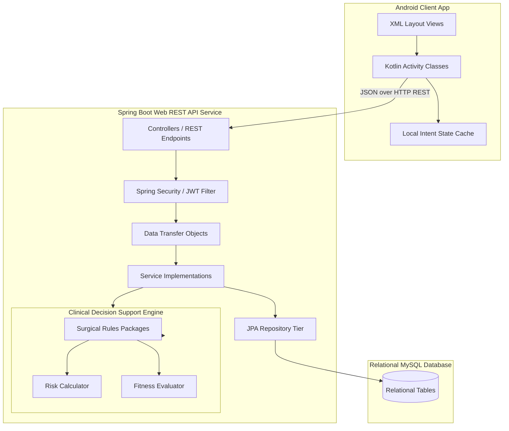

# NeoOMFS System Architecture Document

This document outlines the software architecture of the NeoOMFS Preoperative Assessment and Decision Support System.

## Architecture Pattern Diagram

## Architectural Components

### 1. Android Frontend
- **Model-View-Controller (MVC) Pattern**: Activity classes act as controllers, binding XML layout resource views (`app/src/main/res/layout`) and manipulating widget states.
- **Intent-based State Transfer**: Collects inputs step-by-step in the guided triage wizard and serializes parameter payload maps through intent bundle keys (`patient_name`, `vital_bp_sys`, etc.) to minimize overhead and prevent memory leaks.
- **Persistent Bottom Navigation Stack**: Restructures dashboard panels with `FLAG_ACTIVITY_REORDER_TO_FRONT` to prevent launching duplicate activity instances and preserve navigation speed.

### 2. Spring Boot Backend
- **Controller Layer**: Exposes secure REST API contracts under `/api/v1/*`. Receives payload JSON and maps them to DTOs.
- **Service Layer**: Implements business and clinical transaction logic. Orchestrates calls to the Decision Support Engine.
- **Clinical Decision Engine**: Non-CRUD execution core. Consists of a custom package `rules/` that evaluates vital anomalies, glucose checks, coagulation parameters, and systemic syndromes, classifying overall risk levels (Low, Medium, High).
- **Security Context**: Integrates stateless Spring Security filters verifying Json Web Tokens (JWT) signed using HMAC-SHA key chains.
- **Data Access Layer**: Leverages Spring Data JPA built on top of Hibernate to execute optimized MySQL relational database transactions.
