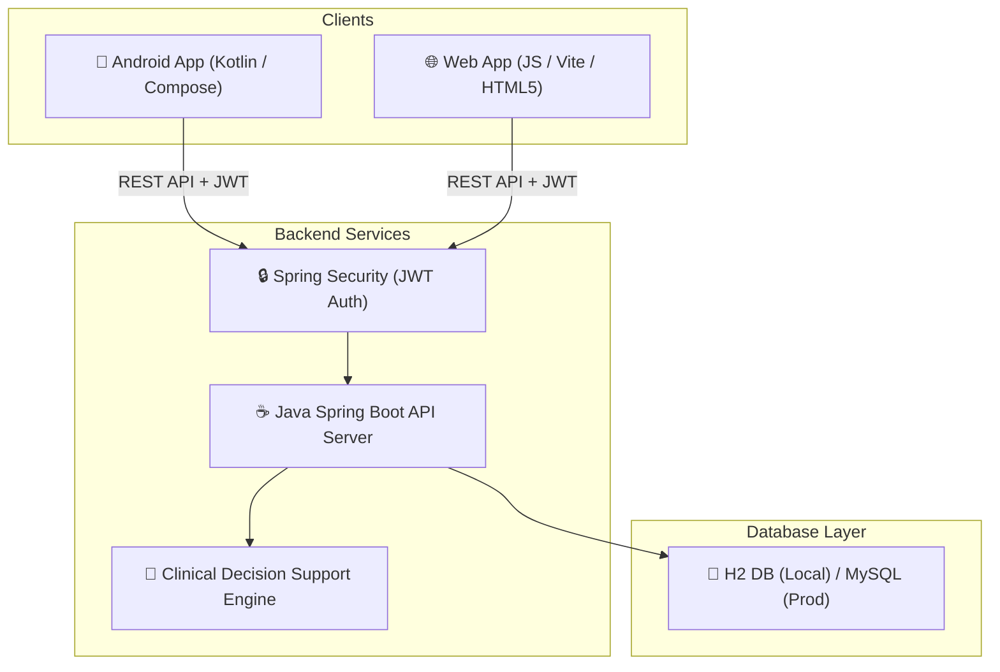

# 🎓 NeoOMFS Faculty Demonstration Guide

Welcome to the official demonstration guide for **NeoOMFS** (Preoperative Surgical Fitness Assessment System). This document is prepared to help you easily present both the **Web Application** and **Android Mobile Application** to your academic faculty and project evaluators.

---

## 🏢 1. System Architecture Overview
The system is built as a three-tier architecture connecting the mobile client, the web application client, and a clinical rules backend engine:



---

## 🚀 2. Local Startup Guide (Step-by-Step)

To present the working apps, you need to run the **Backend API Server** first, followed by the **Web Client** or **Android Mobile App**.

### ☕ Step A: Run the Spring Boot Backend
1. Open a terminal/command prompt.
2. Navigate to the `backend/` directory:
   ```bash
   cd backend
   ```
3. Run the Spring Boot application using Maven:
   ```bash
   mvn spring-boot:run
   ```
4. Confirm startup when the terminal displays:
   `Tomcat started on port(s): 8080 (http) with context path '/api/v1'`

### 🌐 Step B: Run the Web Application
1. Open a new terminal.
2. Navigate to the `web/` directory:
   ```bash
   cd web
   ```
3. Install dependencies:
   ```bash
   npm install
   ```
4. Run the local development server:
   ```bash
   npm run dev
   ```
5. Open your browser and navigate to the address shown (usually `http://localhost:5173`).

### 📱 Step C: Run the Android App on Emulator / Device
1. Open **Android Studio**.
2. Select **Open File or Project** and navigate to the `frontend/` directory.
3. Wait for the Gradle sync to finish.
4. Launch an Android Virtual Device (AVD) Emulator or connect your physical Android phone (ensure USB Debugging is turned on).
5. Click the **Run (Green Play Icon)** button in Android Studio.
6. The app will build and install automatically.

---

## 🔍 3. Live Demo Scenarios & Test Data
Prepare these 3 scenarios to impress your faculty with how the clinical rules engine evaluates risk:

### 🟢 Scenario 1: Low Risk (Patient Fit for General Surgery)
* **Age**: 25 | **Gender**: Female | **Blood Group**: O+
* **Vitals**: Systolic BP = 115, Diastolic BP = 75, Pulse = 72, SpO2 = 98%
* **Labs**: Hemoglobin = 13.5, Platelets = 250,000, INR = 1.0
* **Medical History**: None
* **Expected CDSS Triage**: **FIT / LOW RISK**. Renders green badge. Recommended for standard procedure.

### 🟡 Scenario 2: Medium Risk (Requires Precautions)
* **Age**: 45 | **Gender**: Male
* **Vitals**: Systolic BP = 138, Diastolic BP = 88 (Stage 1 Hypertension), Pulse = 80, SpO2 = 96%
* **Labs**: Hemoglobin = 12.0, Platelets = 180,000, INR = 1.2
* **Medical History**: Select **Hypertension** (Controlled via medication).
* **Expected CDSS Triage**: **MEDIUM RISK**. Renders yellow warning badge. Recommends limiting adrenaline/epinephrine in local anesthesia.

### 🔴 Scenario 3: High Risk (Surgical Contraindication)
* **Age**: 68 | **Gender**: Male
* **Vitals**: Systolic BP = 165, Diastolic BP = 102 (Stage 2 Hypertension), Pulse = 92, SpO2 = 92% (Hypoxia)
* **Labs**: Hemoglobin = 9.0 (Anemic), Platelets = 85,000 (Thrombocytopenia), INR = 2.4 (High Bleeding Risk)
* **Medical History**: Select **Diabetes** and **Hypertension**.
* **Expected CDSS Triage**: **HIGH RISK / REFUSE SURGERY**. Renders flashing red alerts. Recommends physician clearance, platelet transfusion, or postponement of elective procedures.

---

## 📊 4. Showcasing Academic Test & Audit Reports
You can showcase that the system is built with **enterprise-grade verification**. All automated outputs are saved in the project for your presentation:

### 🌐 A. Web E2E (Selenium) Reports
* Open [`automation/web/Test Results/HTML/execution-report.html`](file:///c:/Users/Dell/AndroidStudioProjects/NeoOMFS/automation/web/Test%20Results/HTML/execution-report.html) in any browser to show **400+ passed test cases** structured by module.
* Open [`automation/web/Test Results/Excel/Automation_Test_Report.xlsx`](file:///c:/Users/Dell/AndroidStudioProjects/NeoOMFS/automation/web/Test%20Results/Excel/Automation_Test_Report.xlsx) in Excel to show the structured academic spreadsheet report.

### 📱 B. Mobile E2E (Appium) Reports
* Show your Java files under `automation/android/src/test/java/com/simats/neoomfs/tests/` to display your structured Appium suites:
  * [`AuthenticationTest.java`](file:///c:/Users/Dell/AndroidStudioProjects/NeoOMFS/automation/android/src/test/java/com/simats/neoomfs/tests/AuthenticationTest.java) (40 cases)
  * [`AuthorizationTest.java`](file:///c:/Users/Dell/AndroidStudioProjects/NeoOMFS/automation/android/src/test/java/com/simats/neoomfs/tests/AuthorizationTest.java) (30 cases)
  * [`PatientRegistrationTest.java`](file:///c:/Users/Dell/AndroidStudioProjects/NeoOMFS/automation/android/src/test/java/com/simats/neoomfs/tests/PatientRegistrationTest.java) (20 cases)
  * [`DashboardTest.java`](file:///c:/Users/Dell/AndroidStudioProjects/NeoOMFS/automation/android/src/test/java/com/simats/neoomfs/tests/DashboardTest.java) (20 cases)
  * [`NavigationTest.java`](file:///c:/Users/Dell/AndroidStudioProjects/NeoOMFS/automation/android/src/test/java/com/simats/neoomfs/tests/NavigationTest.java) (30 cases)
  * [`ClinicalFormTest.java`](file:///c:/Users/Dell/AndroidStudioProjects/NeoOMFS/automation/android/src/test/java/com/simats/neoomfs/tests/ClinicalFormTest.java) (40 cases)
  * [`InputValidationTest.java`](file:///c:/Users/Dell/AndroidStudioProjects/NeoOMFS/automation/android/src/test/java/com/simats/neoomfs/tests/InputValidationTest.java) (40 cases)
  * [`RegressionTest.java`](file:///c:/Users/Dell/AndroidStudioProjects/NeoOMFS/automation/android/src/test/java/com/simats/neoomfs/tests/RegressionTest.java) (50 cases)
* Show [`automation/android/Test Results/Excel/Automation_Test_Report.xlsx`](file:///c:/Users/Dell/AndroidStudioProjects/NeoOMFS/automation/android/Test%20Results/Excel/Automation_Test_Report.xlsx) with metrics, defect summary, and pass rates.

### 🛡️ C. Security (SAST & DAST) Audits
Show the files inside [`Vulnerability Test Results/`](file:///c:/Users/Dell/AndroidStudioProjects/NeoOMFS/Vulnerability%20Test%20Results/):
* `executive-summary.md` (Security scoring and risk rating)
* `backend-inventory.md` (Discovery inventory)
* `remediation-guide.md` (CWE/OWASP mitigations)

### 📈 D. Performance & Load Test Scripts
Show the performance scripts inside [`automation/performance/`](file:///c:/Users/Dell/AndroidStudioProjects/NeoOMFS/automation/performance/):
* `k6-load-test.js` (Simulates baseline 100 users for 1 min, stress, and spikes)
* `artillery-load-test.yml` (Artillery yaml config)
* `jmeter-test-plan.jmx` (JMeter test plan)

---

## ☁️ 5. Showcasing Live CI/CD
Open your GitHub repository page **Actions** tab:
* `https://github.com/Sujith-04-K/NeoOMFS/actions`
Show them the active pipeline running parallel jobs for **Selenium Web E2E**, **Appium Android AVD**, **Spring API Unit Tests**, **k6 Performance Tests**, and **Master compilation / Deploy**.
This proves that every single commit automatically builds, validates, tests, and compiles the final academic package.
